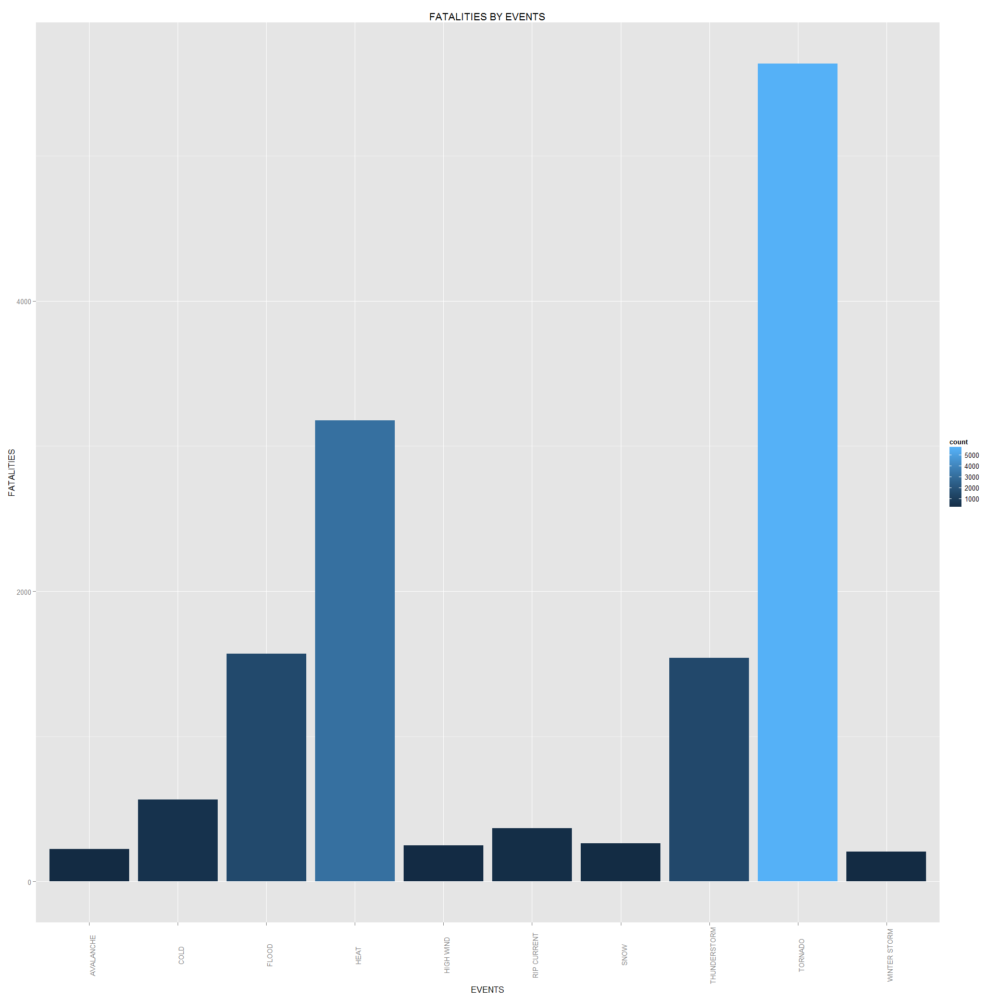
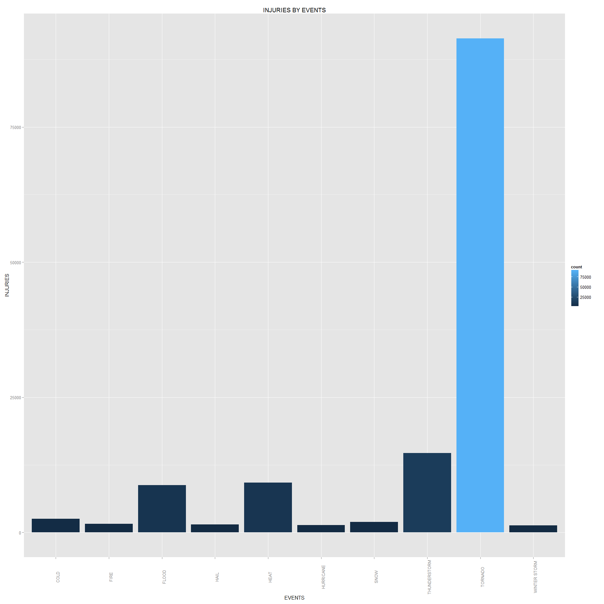
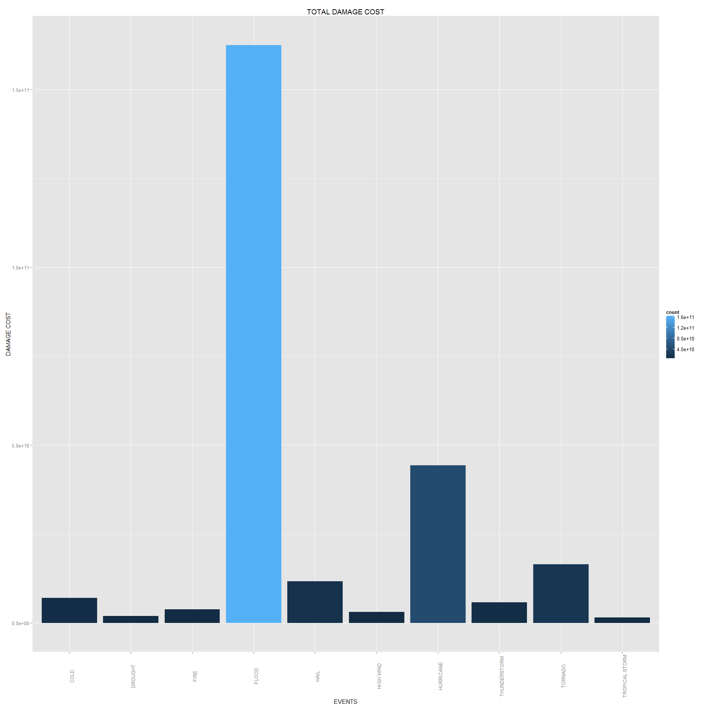

=============================================================================

# Weather Events Harmful to the General Population and Economy

## Edward Lee 7/27/2014

### Course Class Reproducible Research Assignment 27/2014

From the NOAA weather data, we seek to answer which weather event will affect the general population
in terms of human lives as well as the economic damages.  The data will be from the from NOAA weather 
[storm database](http://www.ncdc.noaa.gov/stormevents/details.jsp).
**.pdf** documentation is at [NOAA](http://www.ncdc.noaa.gov/stormevents/pd01016005curr.pdf).

Simply put, across the United States, which types of events are most harmful with respect 
to population health?  Which types of events have the greatest economic consequences?

## Data Processing

There will be categorization of event type that may be subjective.   Not to mention the data collection
of the weather events will be categorized on the field manually and hence subjected to human input errors.


```r
setwd ("C:/Cousera/Course5_Reproducible Research")
```


```r
setInternet2(TRUE)
url <- "https://d396qusza40orc.cloudfront.net/repdata%2Fdata%2FStormData.csv.bz2"
destfile <- "repdata%2Fdata%2FStormData.csv.bz2"
download.file(url,destfile,mode="wb")

url2 <- "https://d396qusza40orc.cloudfront.net/repdata%2Fpeer2_doc%2Fpd01016005curr.pdf"
destfile2 <- "repdata%2Fpeer2_doc%2Fpd01016005curr.pdf"
download.file(url2,destfile2,mode="wb")
```


```r
StormData<- read.csv(bzfile(destfile), stringsAsFactors = FALSE)
names(StormData)
```

```
##  [1] "STATE__"    "BGN_DATE"   "BGN_TIME"   "TIME_ZONE"  "COUNTY"    
##  [6] "COUNTYNAME" "STATE"      "EVTYPE"     "BGN_RANGE"  "BGN_AZI"   
## [11] "BGN_LOCATI" "END_DATE"   "END_TIME"   "COUNTY_END" "COUNTYENDN"
## [16] "END_RANGE"  "END_AZI"    "END_LOCATI" "LENGTH"     "WIDTH"     
## [21] "F"          "MAG"        "FATALITIES" "INJURIES"   "PROPDMG"   
## [26] "PROPDMGEXP" "CROPDMG"    "CROPDMGEXP" "WFO"        "STATEOFFIC"
## [31] "ZONENAMES"  "LATITUDE"   "LONGITUDE"  "LATITUDE_E" "LONGITUDE_"
## [36] "REMARKS"    "REFNUM"
```

```r
summary(StormData$FATALITIES)
```

```
##    Min. 1st Qu.  Median    Mean 3rd Qu.    Max. 
##       0       0       0       0       0     583
```

```r
summary(StormData$INJURIES)
```

```
##    Min. 1st Qu.  Median    Mean 3rd Qu.    Max. 
##     0.0     0.0     0.0     0.2     0.0  1700.0
```

It seems that there are 985 unique types of events, I will endeavor to decrease this list a lot more
I will also create a list for Question 1 for most harmful and Question 2 for damages PROPDMGEXP,CROPDMGEXP
Also, I will only need certain columns FATALITIES INJURIES PROPDMG CROPDMG PROPDMGEXP CROPDMGEXP


```r
KeepCol <- c("EVTYPE","FATALITIES","INJURIES","PROPDMG","CROPDMG","PROPDMGEXP","CROPDMGEXP")
StormDataKeep <- subset(StormData, select = KeepCol)
names(StormDataKeep)
```

```
## [1] "EVTYPE"     "FATALITIES" "INJURIES"   "PROPDMG"    "CROPDMG"   
## [6] "PROPDMGEXP" "CROPDMGEXP"
```

```r
StormDataKeepNZ <- subset(StormDataKeep, FATALITIES > 0 | INJURIES > 0 | PROPDMG > 0 | CROPDMG > 0)
```


```r
StormDataKeepNZ$EVENT <- StormDataKeepNZ$EVTYPE
StormDataKeepNZ$EVENT[grep("flood",StormDataKeepNZ$EVENT, ignore.case = T)] <-"FLOOD"
StormDataKeepNZ$EVENT[grep("warm",StormDataKeepNZ$EVENT, ignore.case = T)] <-"HEAT"
StormDataKeepNZ$EVENT[grep("freeze",StormDataKeepNZ$EVENT, ignore.case = T)] <-"COLD"
StormDataKeepNZ$EVENT[grep("avala",StormDataKeepNZ$EVENT, ignore.case = T)] <-"AVALANCHE"
StormDataKeepNZ$EVENT[grep("ice",StormDataKeepNZ$EVENT, ignore.case = T)] <-"COLD"
StormDataKeepNZ$EVENT[grep("bitter",StormDataKeepNZ$EVENT, ignore.case = T)] <-"COLD"
StormDataKeepNZ$EVENT[grep("BELOW NORMAL PRECIPITATION",StormDataKeepNZ$EVENT, ignore.case = T)] <-"DROUGHT"
StormDataKeepNZ$EVENT[grep("BLIZZARD",StormDataKeepNZ$EVENT, ignore.case = T)] <-"SNOW"
StormDataKeepNZ$EVENT[grep("SNOW",StormDataKeepNZ$EVENT, ignore.case = T)] <-"SNOW"
StormDataKeepNZ$EVENT[grep("dry",StormDataKeepNZ$EVENT, ignore.case = T)] <-"DROUGHT"
StormDataKeepNZ$EVENT[grep("BEACH",StormDataKeepNZ$EVENT, ignore.case = T)] <-"BEACH EROSION"
StormDataKeepNZ$EVENT[grep("FIRE",StormDataKeepNZ$EVENT, ignore.case = T)] <-"FIRE"
StormDataKeepNZ$EVENT[grep("COLD",StormDataKeepNZ$EVENT, ignore.case = T)] <-"COLD"
StormDataKeepNZ$EVENT[grep("RAIN",StormDataKeepNZ$EVENT, ignore.case = T)] <-"RAIN"
StormDataKeepNZ$EVENT[grep("CHILL",StormDataKeepNZ$EVENT, ignore.case = T)] <-"COLD"
StormDataKeepNZ$EVENT[grep("wet",StormDataKeepNZ$EVENT, ignore.case = T)] <-"FLOOD"
StormDataKeepNZ$EVENT[grep("frost",StormDataKeepNZ$EVENT, ignore.case = T)] <-"COLD"
StormDataKeepNZ$EVENT[grep("freez",StormDataKeepNZ$EVENT, ignore.case = T)] <-"COLD"
StormDataKeepNZ$EVENT[grep("gust",StormDataKeepNZ$EVENT, ignore.case = T)] <-"WIND"
StormDataKeepNZ$EVENT[grep("hail",StormDataKeepNZ$EVENT, ignore.case = T)] <-"HAIL"
StormDataKeepNZ$EVENT[grep("heat",StormDataKeepNZ$EVENT, ignore.case = T)] <-"HEAT"
StormDataKeepNZ$EVENT[grep("hurricane",StormDataKeepNZ$EVENT, ignore.case = T)] <-"HURRICANE"
StormDataKeepNZ$EVENT[grep("typhoon",StormDataKeepNZ$EVENT, ignore.case = T)] <-"HURRICANE"
StormDataKeepNZ$EVENT[grep("ice",StormDataKeepNZ$EVENT, ignore.case = T)] <-"COLD"
StormDataKeepNZ$EVENT[grep("icy",StormDataKeepNZ$EVENT, ignore.case = T)] <-"COLD"
StormDataKeepNZ$EVENT[grep("LANDSLIDE",StormDataKeepNZ$EVENT, ignore.case = T)] <-"LANDSLIDES"
StormDataKeepNZ$EVENT[grep("mud",StormDataKeepNZ$EVENT, ignore.case = T)] <-"MUDSLIDES"
StormDataKeepNZ$EVENT[grep("high temp",StormDataKeepNZ$EVENT, ignore.case = T)] <-"HEAT"
StormDataKeepNZ$EVENT[grep("TROPICAL STORM",StormDataKeepNZ$EVENT, ignore.case = T)] <-"TROPICAL STORM"
StormDataKeepNZ$EVENT[grep("light",StormDataKeepNZ$EVENT, ignore.case = T)] <-"THUNDERSTORM"
StormDataKeepNZ$EVENT[grep("tstm",StormDataKeepNZ$EVENT, ignore.case = T)] <-"THUNDERSTORM"
StormDataKeepNZ$EVENT[grep("torn",StormDataKeepNZ$EVENT, ignore.case = T)] <-"TORNADO"
StormDataKeepNZ$EVENT[grep("tide",StormDataKeepNZ$EVENT, ignore.case = T)] <-"FLOOD"
StormDataKeepNZ$EVENT[grep("tsu",StormDataKeepNZ$EVENT, ignore.case = T)] <-"FLOOD"
StormDataKeepNZ$EVENT[grep("thun",StormDataKeepNZ$EVENT, ignore.case = T)] <-"THUNDERSTORM"
StormDataKeepNZ$EVENT[grep("tsu",StormDataKeepNZ$EVENT, ignore.case = T)] <-"FLOOD"


StormDataKeepNZ$PropertyDamageAmt <- StormDataKeepNZ$PROPDMG
MultLookup <- c(M = 10^6, m = 10^6, K = 10^3, k = 10^3, B = 10^9, b = 10^9)

StormDataKeepNZ$PropertyDamageAmt <- StormDataKeepNZ$PROPDMG * MultLookup [as.character(StormDataKeepNZ$PROPDMGEXP)]
StormDataKeepNZ$CropDamageAmt     <- StormDataKeepNZ$CROPDMG * MultLookup [as.character(StormDataKeepNZ$CROPDMGEXP)]
StormDataKeepNZ$TotDamageAmt   <- StormDataKeepNZ$PropertyDamageAmt + StormDataKeepNZ$CropDamageAmt
```

====================================================================

# RESULTS
Now we will aggregate the results and output the top 10 events graphically.  This will answer the
2 questions


```r
library(plyr)
SFatal <- ddply(StormDataKeepNZ, .(EVENT), summarize, DEATHS = sum(FATALITIES, na.rm = TRUE))
SInjury <- ddply(StormDataKeepNZ, .(EVENT), summarize, INJURED = sum(INJURIES, na.rm = TRUE))
SPropDam <- ddply(StormDataKeepNZ, .(EVENT), summarize, PROPERTYCOST = sum(PropertyDamageAmt, na.rm = TRUE))
SCropDam <- ddply(StormDataKeepNZ, .(EVENT), summarize, CROPCOST = sum(CropDamageAmt, na.rm = TRUE))
STotDam <- ddply(StormDataKeepNZ, .(EVENT), summarize, TOTALCOST = sum(TotDamageAmt, na.rm = TRUE))


SDEATH10 <- head(SFatal[order(-SFatal$DEATHS),],10)
SINJURED10 <- head(SInjury [order(-SInjury$INJURED),],10)
SPropDam10 <- head(SPropDam[order(-SPropDam$PROPERTYCOST),],10)
SCropDam10 <- head(SCropDam[order(-SCropDam$CROPCOST),],10)
STotDam10 <- head(STotDam[order(-STotDam$TOTALCOST),],10)

SDEATH10
```

```
##            EVENT DEATHS
## 106      TORNADO   5636
## 35          HEAT   3178
## 25         FLOOD   1569
## 105 THUNDERSTORM   1542
## 12          COLD    566
## 87   RIP CURRENT    368
## 97          SNOW    264
## 53     HIGH WIND    248
## 4      AVALANCHE    225
## 126 WINTER STORM    206
```

```r
SINJURED10
```

```
##            EVENT INJURED
## 106      TORNADO   91407
## 105 THUNDERSTORM   14679
## 35          HEAT    9243
## 25         FLOOD    8738
## 12          COLD    2538
## 97          SNOW    1958
## 24          FIRE    1608
## 33          HAIL    1467
## 61     HURRICANE    1333
## 126 WINTER STORM    1321
```

```r
SPropDam10
```

```
##              EVENT PROPERTYCOST
## 25           FLOOD    1.723e+11
## 61       HURRICANE    8.536e+10
## 106        TORNADO    5.699e+10
## 99     STORM SURGE    4.332e+10
## 33            HAIL    1.762e+10
## 105   THUNDERSTORM    1.186e+10
## 24            FIRE    8.502e+09
## 108 TROPICAL STORM    7.714e+09
## 126   WINTER STORM    6.688e+09
## 53       HIGH WIND    5.270e+09
```

```r
SCropDam10
```

```
##              EVENT  CROPCOST
## 17         DROUGHT 1.397e+10
## 25           FLOOD 1.253e+10
## 12            COLD 8.453e+09
## 61       HURRICANE 5.516e+09
## 33            HAIL 3.114e+09
## 105   THUNDERSTORM 1.219e+09
## 35            HEAT 9.045e+08
## 85            RAIN 8.062e+08
## 108 TROPICAL STORM 6.949e+08
## 53       HIGH WIND 6.386e+08
```

```r
STotDam10
```

```
##              EVENT TOTALCOST
## 25           FLOOD 1.625e+11
## 61       HURRICANE 4.433e+10
## 106        TORNADO 1.652e+10
## 33            HAIL 1.165e+10
## 12            COLD 7.002e+09
## 105   THUNDERSTORM 5.805e+09
## 24            FIRE 3.839e+09
## 53       HIGH WIND 3.058e+09
## 17         DROUGHT 1.887e+09
## 108 TROPICAL STORM 1.530e+09
```
=========================================================

## Graphing the results


```r
library (ggplot2)
ggplot (SDEATH10,aes(EVENT)) + 
	geom_histogram(aes(weight=DEATHS, fill =..count..),binwidth=1) + 
	xlab("EVENTS") + theme(axis.text.x=element_text(angle = 90)) + 
	ylab("FATALITIES") + 
	ggtitle("FATALITIES BY EVENTS")
```

 


```r
ggplot (SINJURED10,aes(EVENT)) + 
	geom_histogram(aes(weight=INJURED, fill =..count..),binwidth=1) + 
	xlab("EVENTS") + theme(axis.text.x=element_text(angle = 90)) + 
	ylab("INJURIES") + 
	ggtitle("INJURIES BY EVENTS")
```

 


```r
ggplot (STotDam10,aes(EVENT)) + 
	geom_histogram(aes(weight=TOTALCOST, fill =..count..),binwidth=1) + 
	xlab("EVENTS") + theme(axis.text.x=element_text(angle = 90)) + 
	ylab("DAMAGE COST") + 
	ggtitle("TOTAL DAMAGE COST")
```

 

	
================================================================================

## SUMMARY

The main causes of property damage are floods, hurricanes and toradoes
Crop damages are generally caused by drought, flood, and cold

Fatalities are far and away caused by tornadoes and thunderstorms
Injuries are also far and away caused by tornadoes, with heat, thunderstorms.


